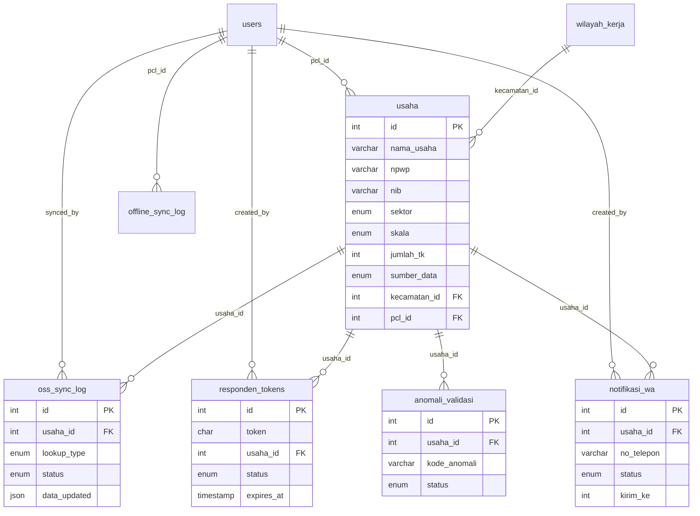

# Dokumen Desain: SE2026 Jember Enhancement

## Overview

SISE2026 Enhancement adalah perluasan komprehensif dari sistem informasi Sensus Ekonomi 2026 BPS Kabupaten Jember. Sistem yang ada saat ini adalah aplikasi PHP MVC sederhana yang berjalan di shared hosting Jagoan Hosting, mengelola rekrutmen, pelatihan, pengolahan anomali, dokumentasi, dan administrasi teknis.

Enhancement ini menambahkan 10 kapabilitas baru yang tetap kompatibel dengan infrastruktur shared hosting yang ada:

1. **Offline-First** — IndexedDB + Service Worker Sync Engine untuk PCL di lapangan
2. **Dashboard Analitik Real-Time** — Chart.js dengan polling 5 menit dan ekspor CSV
3. **Validasi Data Otomatis** — Validator class berbasis aturan, deteksi duplikat, NPWP, alamat
4. **Pemetaan Spasial Heatmap** — Leaflet.js + leaflet.heat di atas OpenStreetMap
5. **Notifikasi WhatsApp** — WhatsApp Business API dengan fallback CSV
6. **Pelaporan Mandiri Responden** — Token-based URL, mobile-friendly 320px+
7. **Data Dummy Ekstensif** — 50.000+ entri, 31 kecamatan, edge cases, historis 3 tahun
8. **Stress Testing & QA** — PHPUnit, 80% coverage, 100 pengguna simultan
9. **Dokumentasi Teknis** — OpenAPI 3.0, ERD, deployment guide
10. **Integrasi OSS** — Sinkronisasi NIB/NPWP, batch 100 entri

### Prinsip Desain

- **Backward Compatible**: Semua modul existing tetap berfungsi tanpa modifikasi
- **Shared Hosting Friendly**: Tidak memerlukan Node.js, Redis, atau daemon proses
- **Progressive Enhancement**: Fitur offline dan peta bersifat opsional dan graceful degradation
- **Minimal Dependencies**: Hanya library yang dapat di-bundle atau di-CDN

---

## Architecture

Arsitektur tetap menggunakan pola MVC PHP yang sudah ada, dengan penambahan layer baru:

```mermaid
graph TB
    subgraph Browser
        SW[Service Worker]
        IDB[(IndexedDB)]
        JS[JavaScript Modules]
        SW <--> IDB
        JS <--> IDB
    end

    subgraph Frontend Assets
        ChartJS[Chart.js]
        Leaflet[Leaflet.js + leaflet.heat]
        JS --> ChartJS
        JS --> Leaflet
    end

    subgraph PHP MVC - index.php Front Controller
        Router[Router]
        Router --> AuthCtrl[AuthController]
        Router --> DashCtrl[DashboardController NEW]
        Router --> ValidCtrl[ValidasiController NEW]
        Router --> PetaCtrl[PetaController NEW]
        Router --> WACtrl[NotifikasiController NEW]
        Router --> RespondenCtrl[RespondenController NEW]
        Router --> OSSCtrl[OSSController NEW]
        Router --> ExistingCtrl[Existing Controllers]
    end

    subgraph Models
        UsahaModel[UsahaModel NEW]
        ValidatorModel[ValidatorModel NEW]
        NotifModel[NotifikasiModel NEW]
        OSSModel[OSSModel NEW]
        ExistingModels[Existing Models]
    end

    subgraph Utils
        Validator[Validator.php NEW]
        DummyGen[DummyGenerator.php NEW]
        WANotifier[WhatsAppNotifier.php NEW]
        OSSClient[OSSClient.php NEW]
        CSVExporter[CSVExporter.php NEW]
    end

    subgraph Database MySQL
        ExistingTables[(Existing Tables)]
        NewTables[(New Tables)]
    end

    Browser <-->|HTTP/JSON API| Router
    SW <-->|Background Sync| Router
    PHP MVC - index.php Front Controller --> Models
    Models --> Utils
    Models --> Database MySQL
```

### Keputusan Arsitektur

**1. Service Worker sebagai Sync Engine**
Dipilih karena berjalan di browser tanpa memerlukan server-side daemon. Service Worker menangkap request POST ke endpoint `/api/usaha` dan menyimpannya ke IndexedDB saat offline, lalu memutar ulang saat online.

**2. Polling vs WebSocket untuk Dashboard**
WebSocket tidak tersedia di shared hosting. Polling setiap 5 menit via `setInterval` + `fetch` ke endpoint JSON adalah solusi yang kompatibel.

**3. Leaflet.js + OpenStreetMap**
Tidak memerlukan API key berbayar. Tile OpenStreetMap gratis dan dapat di-cache oleh Service Worker.

**4. WhatsApp Business API via HTTP**
Dipanggil dari PHP menggunakan `curl`. Tidak memerlukan library tambahan. Fallback ke CSV jika API tidak tersedia.

**5. Token Responden sebagai UUID**
Token 32-karakter hex disimpan di database dengan expiry 30 hari. Tidak memerlukan JWT library.

---

## Components and Interfaces

### 1. Offline-First Module

#### Service Worker (`assets/js/sw.js`)

```javascript
// Strategi cache: Network First untuk API, Cache First untuk assets statis
// Background Sync API untuk antrian offline
self.addEventListener('sync', event => {
    if (event.tag === 'sync-offline-queue') {
        event.waitUntil(syncOfflineQueue());
    }
});
```

**Interface IndexedDB Store `offline_queue`:**
```
{
  id: autoincrement,
  data: Object,        // payload form usaha
  timestamp: number,   // Unix timestamp
  status: 'pending' | 'syncing' | 'conflict' | 'done',
  retry_count: number
}
```

#### API Endpoint Sync (`?page=api&sub=sync`)

```
POST ?page=api&sub=sync
Content-Type: application/json
Authorization: Bearer {session_token}

Body: { entries: [ UsahaPayload[] ] }

Response 200: { synced: number, conflicts: number, conflict_ids: number[] }
Response 409: { conflict: true, entry_id: number, reason: string }
```

### 2. Dashboard Analitik

#### DashboardController (`src/Controllers/DashboardController.php`)

```php
class DashboardController {
    public static function handleIndex(): void   // render view dashboard
    public static function handleApiStats(): void // JSON: stats per kecamatan
    public static function handleApiTrend(): void // JSON: tren harian
    public static function handleExportCsv(): void // download CSV
}
```

#### Dashboard View (`views/dashboard/index.php`)

Komponen Chart.js yang diinisialisasi:
- `BarChart` — progres per kecamatan (31 bar)
- `LineChart` — tren pertumbuhan harian
- `DoughnutChart` — distribusi UMK/UM/UB
- `BarChart` — kinerja enumerator (top 10)

#### Polling JavaScript (`assets/js/dashboard.js`)

```javascript
// Polling setiap 5 menit
setInterval(() => fetchAndUpdateCharts(), 5 * 60 * 1000);
```

### 3. Validator

#### Validator Class (`src/Utils/Validator.php`)

```php
class Validator {
    public static function validate(array $data): ValidationResult
    public static function checkDuplicate(array $data): bool
    public static function validateNpwp(string $npwp): bool
    public static function validateAlamat(array $alamat): bool
    public static function checkSkalaConsistency(string $skala, int $tenaga_kerja): bool
    public static function generateDailyReport(): array
}
```

**ValidationResult:**
```php
class ValidationResult {
    public bool $valid;
    public array $errors;   // [ ['code' => 'NPWP_INVALID', 'field' => 'npwp', 'message' => '...'] ]
    public array $warnings; // duplikat potensial
}
```

**Aturan Validasi:**
| Kode | Kondisi | Aksi |
|------|---------|------|
| `NPWP_INVALID` | NPWP bukan 15 digit numerik | Tandai anomali |
| `ALAMAT_TIDAK_LENGKAP` | Tidak ada jalan/nomor/kecamatan | Tandai anomali |
| `DUPLIKAT_POTENSIAL` | Similarity nama+alamat+telp > 90% | Tandai, minta konfirmasi PML |
| `SKALA_TK_TIDAK_KONSISTEN` | Skala vs jumlah TK tidak sesuai UU 20/2008 | Tandai anomali |
| `DUPLIKAT_PCL` | Data sama dari 2 PCL dalam 24 jam | Tahan, minta konfirmasi PML |

**Definisi Skala Usaha (UU No. 20/2008):**
- Mikro: TK ≤ 4
- Kecil: TK 5–19
- Menengah: TK 20–99
- Besar: TK ≥ 100

### 4. Peta Heatmap

#### PetaController (`src/Controllers/PetaController.php`)

```php
class PetaController {
    public static function handleIndex(): void       // render view peta
    public static function handleApiHeatmap(): void  // JSON: koordinat + bobot
    public static function handleApiMarkers(): void  // JSON: marker per kecamatan
}
```

#### Struktur Data Heatmap

```json
{
  "heatmap_points": [[-8.1667, 113.7000, 0.8], ...],
  "markers": [
    {
      "kecamatan": "Kaliwates",
      "lat": -8.1500,
      "lng": 113.7500,
      "total_usaha": 12450,
      "target": 15000,
      "pct_capaian": 83.0,
      "per_sektor": { "pertanian": 120, "perdagangan": 8900, "jasa": 2800, "manufaktur": 630 }
    }
  ]
}
```

### 5. WhatsApp Notifier

#### WhatsAppNotifier (`src/Utils/WhatsAppNotifier.php`)

```php
class WhatsAppNotifier {
    public function __construct(string $apiToken, string $phoneNumberId)
    public function send(string $to, string $templateName, array $params): NotifResult
    public function sendBatch(array $recipients, string $templateName): BatchResult
    public function scheduleBatch(array $recipients, string $templateName, DateTime $sendAt): int
}
```

#### NotifikasiController (`src/Controllers/NotifikasiController.php`)

```php
class NotifikasiController {
    public static function handleIndex(): void
    public static function handleKirim(): void
    public static function handleJadwal(): void
    public static function handleExportCsv(): void  // fallback
    public static function handleApiStats(): void
}
```

### 6. Pelaporan Mandiri Responden

#### RespondenController (`src/Controllers/RespondenController.php`)

```php
class RespondenController {
    public static function handleForm(): void      // tampilkan form via token
    public static function handleSubmit(): void    // proses submit
    public static function handleExpired(): void   // token expired/used
}
```

**Token Flow:**
```
Admin generates token → simpan ke tabel responden_tokens
→ kirim URL: ?page=responden&token={32hex}
→ Responden buka URL → validasi token → tampilkan form pre-filled
→ Submit → Validator → simpan ke usaha + tandai token used
→ Kirim konfirmasi WA/SMS
```

### 7. OSS Integration

#### OSSClient (`src/Utils/OSSClient.php`)

```php
class OSSClient {
    public function __construct(string $apiKey, string $baseUrl)
    public function lookupByNib(string $nib): OSSResult
    public function lookupByNpwp(string $npwp): OSSResult
    public function batchSync(array $usahaIds): BatchSyncResult
}
```

---

## Data Models

### Tabel Baru yang Diperlukan

#### `usaha` — Data Usaha Utama

```sql
CREATE TABLE usaha (
    id              INT AUTO_INCREMENT PRIMARY KEY,
    nama_usaha      VARCHAR(200) NOT NULL,
    nama_pemilik    VARCHAR(150),
    npwp            VARCHAR(20),
    nib             VARCHAR(20),
    no_telepon      VARCHAR(20),
    email           VARCHAR(150),
    -- Alamat
    jalan           VARCHAR(200),
    nomor           VARCHAR(20),
    kecamatan_id    INT,
    kelurahan       VARCHAR(100),
    kode_pos        VARCHAR(10),
    lat             DECIMAL(10,7),
    lng             DECIMAL(10,7),
    -- Klasifikasi
    kbli            VARCHAR(10),
    sektor          ENUM('pertanian','perdagangan','jasa','manufaktur','lainnya'),
    skala           ENUM('mikro','kecil','menengah','besar'),
    jumlah_tk       INT DEFAULT 0,
    omzet_tahunan   DECIMAL(15,2),
    -- Status
    status_legalitas ENUM('belum_terverifikasi','terverifikasi_oss','tidak_terdaftar') DEFAULT 'belum_terverifikasi',
    sumber_data     ENUM('pcl','mandiri') DEFAULT 'pcl',
    pcl_id          INT,
    tahun_data      YEAR DEFAULT 2026,
    -- Timestamps
    created_at      TIMESTAMP DEFAULT CURRENT_TIMESTAMP,
    updated_at      TIMESTAMP DEFAULT CURRENT_TIMESTAMP ON UPDATE CURRENT_TIMESTAMP,
    FOREIGN KEY (kecamatan_id) REFERENCES wilayah_kerja(id) ON DELETE SET NULL,
    FOREIGN KEY (pcl_id) REFERENCES users(id) ON DELETE SET NULL,
    INDEX idx_usaha_kecamatan (kecamatan_id),
    INDEX idx_usaha_sektor (sektor),
    INDEX idx_usaha_skala (skala),
    INDEX idx_usaha_tahun (tahun_data)
) ENGINE=InnoDB;
```

#### `anomali_validasi` — Hasil Validasi Otomatis

```sql
CREATE TABLE anomali_validasi (
    id              INT AUTO_INCREMENT PRIMARY KEY,
    usaha_id        INT NOT NULL,
    kode_anomali    VARCHAR(50) NOT NULL,  -- NPWP_INVALID, ALAMAT_TIDAK_LENGKAP, dll
    jenis_anomali   VARCHAR(100),
    detail          TEXT,
    status          ENUM('open','resolved','dismissed') DEFAULT 'open',
    resolved_by     INT,
    resolved_at     TIMESTAMP NULL,
    created_at      TIMESTAMP DEFAULT CURRENT_TIMESTAMP,
    FOREIGN KEY (usaha_id) REFERENCES usaha(id) ON DELETE CASCADE,
    FOREIGN KEY (resolved_by) REFERENCES users(id) ON DELETE SET NULL,
    INDEX idx_anomali_kode (kode_anomali),
    INDEX idx_anomali_status (status)
) ENGINE=InnoDB;
```

#### `notifikasi_wa` — Log Notifikasi WhatsApp

```sql
CREATE TABLE notifikasi_wa (
    id              INT AUTO_INCREMENT PRIMARY KEY,
    usaha_id        INT,
    no_telepon      VARCHAR(20) NOT NULL,
    template_name   VARCHAR(100),
    status          ENUM('pending','terkirim','gagal','dibaca') DEFAULT 'pending',
    wa_message_id   VARCHAR(100),
    error_message   TEXT,
    kirim_ke        INT DEFAULT 1,  -- counter pengiriman ke responden ini
    scheduled_at    TIMESTAMP NULL,
    sent_at         TIMESTAMP NULL,
    created_by      INT,
    created_at      TIMESTAMP DEFAULT CURRENT_TIMESTAMP,
    FOREIGN KEY (usaha_id) REFERENCES usaha(id) ON DELETE SET NULL,
    FOREIGN KEY (created_by) REFERENCES users(id) ON DELETE SET NULL,
    INDEX idx_notif_status (status),
    INDEX idx_notif_usaha (usaha_id)
) ENGINE=InnoDB;
```

#### `responden_tokens` — Token Pelaporan Mandiri

```sql
CREATE TABLE responden_tokens (
    id              INT AUTO_INCREMENT PRIMARY KEY,
    token           CHAR(32) UNIQUE NOT NULL,
    usaha_id        INT,
    status          ENUM('active','used','expired') DEFAULT 'active',
    expires_at      TIMESTAMP NOT NULL,
    used_at         TIMESTAMP NULL,
    created_by      INT,
    created_at      TIMESTAMP DEFAULT CURRENT_TIMESTAMP,
    FOREIGN KEY (usaha_id) REFERENCES usaha(id) ON DELETE CASCADE,
    FOREIGN KEY (created_by) REFERENCES users(id) ON DELETE SET NULL,
    INDEX idx_token_lookup (token, status)
) ENGINE=InnoDB;
```

#### `oss_sync_log` — Riwayat Sinkronisasi OSS

```sql
CREATE TABLE oss_sync_log (
    id              INT AUTO_INCREMENT PRIMARY KEY,
    usaha_id        INT NOT NULL,
    lookup_key      VARCHAR(30),   -- NIB atau NPWP yang digunakan
    lookup_type     ENUM('nib','npwp'),
    status          ENUM('berhasil','gagal') NOT NULL,
    data_updated    JSON,          -- field yang diperbarui
    error_message   TEXT,
    synced_by       INT,
    synced_at       TIMESTAMP DEFAULT CURRENT_TIMESTAMP,
    FOREIGN KEY (usaha_id) REFERENCES usaha(id) ON DELETE CASCADE,
    FOREIGN KEY (synced_by) REFERENCES users(id) ON DELETE SET NULL,
    INDEX idx_oss_usaha (usaha_id),
    INDEX idx_oss_synced (synced_at)
) ENGINE=InnoDB;
```

#### `offline_sync_log` — Log Sinkronisasi Offline

```sql
CREATE TABLE offline_sync_log (
    id              INT AUTO_INCREMENT PRIMARY KEY,
    pcl_id          INT,
    batch_id        VARCHAR(36),   -- UUID per sesi sync
    total_entries   INT DEFAULT 0,
    synced_ok       INT DEFAULT 0,
    synced_conflict INT DEFAULT 0,
    synced_at       TIMESTAMP DEFAULT CURRENT_TIMESTAMP,
    FOREIGN KEY (pcl_id) REFERENCES users(id) ON DELETE SET NULL
) ENGINE=InnoDB;
```

### ERD Ringkas (Tabel Baru + Relasi ke Existing)



---


## Correctness Properties

*A property is a characteristic or behavior that should hold true across all valid executions of a system — essentially, a formal statement about what the system should do. Properties serve as the bridge between human-readable specifications and machine-verifiable correctness guarantees.*

### Property 1: Offline Queue Persistence

*For any* data usaha yang valid yang diisi saat kondisi offline, setelah disimpan ke Offline_Queue, query ke IndexedDB harus mengembalikan entri tersebut dengan status 'pending'.

**Validates: Requirements 1.1**

---

### Property 2: Sync Chronological Order

*For any* kumpulan entri di Offline_Queue dengan timestamp berbeda, setelah Sync_Engine mengunggah ke server, server harus menerima entri dalam urutan timestamp ascending (kronologis).

**Validates: Requirements 1.2**

---

### Property 3: Conflict Detection on Sync

*For any* entri di Offline_Queue yang identik dengan data yang sudah ada di server (duplikat), setelah Sync_Engine mencoba mengunggah, entri tersebut harus ditandai dengan status 'konflik' dan tidak disimpan ke database.

**Validates: Requirements 1.4**

---

### Property 4: Stale Data Detection

*For any* entri di Offline_Queue dengan timestamp lebih dari 7 hari yang lalu, fungsi `isStale()` harus mengembalikan `true`.

**Validates: Requirements 1.7**

---

### Property 5: Dashboard Grouping Completeness

*For any* dataset usaha, hasil fungsi `groupByKategori()` harus memiliki jumlah total entri yang sama dengan jumlah entri di dataset asal (tidak ada data yang hilang saat pengelompokan).

**Validates: Requirements 2.1**

---

### Property 6: Dashboard Filter Correctness

*For any* filter kecamatan yang dipilih, semua entri dalam hasil filter harus memiliki `kecamatan_id` yang sesuai dengan filter tersebut, dan tidak ada entri dari kecamatan lain.

**Validates: Requirements 2.4**

---

### Property 7: Enumerator Ranking Order

*For any* dataset kinerja enumerator, hasil fungsi `rankEnumerator()` harus terurut secara descending berdasarkan jumlah usaha yang didata, sehingga `result[i].jumlah >= result[i+1].jumlah` untuk semua i.

**Validates: Requirements 2.5**

---

### Property 8: CSV Export Round-Trip

*For any* dataset ringkasan dashboard, file CSV yang dihasilkan oleh `exportCsv()` harus berisi jumlah baris yang sama dengan jumlah entri di dataset (tidak ada data yang hilang saat ekspor).

**Validates: Requirements 2.6**

---

### Property 9: Validator Flags Invalid Data

*For any* data usaha yang mengandung setidaknya satu pelanggaran aturan validasi, fungsi `Validator::validate()` harus mengembalikan `ValidationResult` dengan `valid = false` dan array `errors` yang tidak kosong.

**Validates: Requirements 3.1**

---

### Property 10: Duplicate Detection Threshold

*For any* dua entri data usaha dengan similarity nama+alamat+telepon di atas 90%, fungsi `Validator::checkDuplicate()` harus mengembalikan `true`. Untuk similarity di bawah 90%, harus mengembalikan `false`.

**Validates: Requirements 3.2**

---

### Property 11: NPWP Format Validation

*For any* string yang bukan tepat 15 karakter numerik, fungsi `Validator::validateNpwp()` harus mengembalikan `false`. Untuk string yang tepat 15 karakter numerik, harus mengembalikan `true`.

**Validates: Requirements 3.3**

---

### Property 12: Address Completeness Validation

*For any* data alamat yang tidak memiliki setidaknya satu dari tiga komponen (jalan, nomor, kecamatan), fungsi `Validator::validateAlamat()` harus mengembalikan `false`.

**Validates: Requirements 3.4**

---

### Property 13: Anomali Persistence Round-Trip

*For any* data usaha yang gagal validasi, setelah `Validator::validate()` dijalankan, tabel `anomali_validasi` harus berisi entri baru dengan `usaha_id` yang sesuai dan `kode_anomali` yang benar.

**Validates: Requirements 3.5**

---

### Property 14: Daily Anomali Report Accuracy

*For any* dataset anomali di database, laporan harian yang dihasilkan oleh `Validator::generateDailyReport()` harus memiliki jumlah total anomali yang sama dengan jumlah entri di dataset (tidak ada anomali yang hilang dalam agregasi).

**Validates: Requirements 3.6**

---

### Property 15: Cross-PCL Duplicate Detection

*For any* dua entri data usaha yang identik yang dikirimkan oleh dua PCL berbeda dalam rentang 24 jam, Validator harus menandai salah satu sebagai duplikat potensial dengan kode `DUPLIKAT_PCL`.

**Validates: Requirements 3.7**

---

### Property 16: Scale-Workforce Consistency

*For any* pasangan (skala_usaha, jumlah_tk), fungsi `Validator::checkSkalaConsistency()` harus mengembalikan `false` jika kombinasi tersebut melanggar definisi UU No. 20/2008 (mikro: TK ≤ 4, kecil: TK 5–19, menengah: TK 20–99, besar: TK ≥ 100).

**Validates: Requirements 3.8**

---

### Property 17: Heatmap Data Validity

*For any* dataset usaha dengan koordinat GPS, fungsi `generateHeatmapPoints()` harus menghasilkan array di mana setiap elemen berupa tuple `[lat, lng, weight]` dengan `lat` antara -90 dan 90, `lng` antara -180 dan 180, dan `weight` antara 0 dan 1.

**Validates: Requirements 4.2**

---

### Property 18: Marker Data Completeness

*For any* dataset usaha, fungsi `generateMarkers()` harus menghasilkan marker untuk setiap kecamatan yang memiliki data, dan setiap marker harus memiliki field `nama_kecamatan`, `total_usaha`, dan `pct_capaian`.

**Validates: Requirements 4.3, 4.4**

---

### Property 19: Map Filter Correctness

*For any* kombinasi filter (sektor, skala), fungsi `filterUsahaForMap()` harus mengembalikan hanya entri yang sesuai dengan semua filter yang aktif.

**Validates: Requirements 4.5, 4.6**

---

### Property 20: Notification Rate Limiting

*For any* responden yang sudah menerima 3 notifikasi WhatsApp dalam periode sensus yang sama, fungsi `canSendNotification()` harus mengembalikan `false` dan pengiriman ke-4 harus ditolak.

**Validates: Requirements 5.4**

---

### Property 21: Notification Log and Stats Invariant

*For any* operasi pengiriman notifikasi (berhasil atau gagal), setelah operasi selesai, tabel `notifikasi_wa` harus berisi entri baru dengan status yang sesuai, dan total `terkirim + gagal + pending` dalam statistik harus sama dengan total entri di log.

**Validates: Requirements 5.2, 5.5**

---

### Property 22: Business Hours Scheduling

*For any* waktu pengiriman yang dijadwalkan di luar jam 08.00–17.00 WIB, fungsi `validateScheduleTime()` harus mengembalikan `false`.

**Validates: Requirements 5.6**

---

### Property 23: CSV Fallback Completeness

*For any* daftar responden, file CSV fallback yang dihasilkan oleh `exportNotifCsv()` harus berisi semua nomor telepon dari daftar tersebut.

**Validates: Requirements 5.7**

---

### Property 24: Token Lookup Round-Trip

*For any* token yang valid dan aktif yang tersimpan di database, fungsi `lookupToken()` harus mengembalikan data usaha yang terkait dengan token tersebut.

**Validates: Requirements 6.1, 6.2**

---

### Property 25: Expired Token Rejection

*For any* token dengan status 'used' atau dengan `expires_at` lebih dari 30 hari yang lalu, fungsi `validateToken()` harus mengembalikan `false`.

**Validates: Requirements 6.5**

---

### Property 26: Data Source Tracking

*For any* entri usaha yang disimpan melalui formulir pelaporan mandiri (via token), field `sumber_data` harus bernilai 'mandiri'. Untuk entri yang disimpan oleh PCL, harus bernilai 'pcl'.

**Validates: Requirements 6.7**

---

### Property 27: Dummy Data Distribution

*For any* run dari `DummyGenerator`, dataset yang dihasilkan harus memiliki distribusi sektor mendekati target (pertanian ±2%, perdagangan ±2%, jasa ±2%, manufaktur ±2%) dan distribusi skala mendekati target (mikro ±2%, kecil ±2%, menengah ±1%, besar ±1%).

**Validates: Requirements 7.2, 7.3**

---

### Property 28: Dummy Edge Cases Count

*For any* run dari `DummyGenerator`, dataset yang dihasilkan harus berisi setidaknya 500 entri dengan NPWP tidak valid, 300 entri dengan alamat tidak lengkap, dan 200 entri duplikat.

**Validates: Requirements 7.4**

---

### Property 29: Dummy SQL Validity

*For any* output dari `DummyGenerator::generateSql()`, string SQL yang dihasilkan harus dapat di-parse sebagai SQL valid (tidak ada syntax error) dan setelah dieksekusi, jumlah baris di tabel `usaha` harus bertambah sesuai jumlah entri yang digenerate.

**Validates: Requirements 7.6**

---

### Property 30: OSS Sync Data Update

*For any* entri usaha yang berhasil disinkronisasi dengan OSS API, field `status_legalitas`, `nama_usaha`, dan alamat di tabel `usaha` harus diperbarui sesuai data yang dikembalikan OSS API.

**Validates: Requirements 10.2**

---

### Property 31: OSS Error Immutability

*For any* kondisi di mana OSS API mengembalikan error atau tidak dapat dijangkau, data usaha di database harus tidak berubah setelah percobaan sinkronisasi, dan tabel `oss_sync_log` harus berisi entri baru dengan status 'gagal'.

**Validates: Requirements 10.3, 10.4**

---

### Property 32: OSS Batch Completeness

*For any* batch sinkronisasi OSS dengan 1 hingga 100 entri, semua entri dalam batch harus diproses (baik berhasil maupun gagal), dan tidak ada entri yang dilewati.

**Validates: Requirements 10.5**

---

### Property 33: Missing NIB Status

*For any* entri usaha yang tidak memiliki NIB (field `nib` adalah NULL atau kosong), field `status_legalitas` harus bernilai 'belum_terverifikasi'.

**Validates: Requirements 10.6**

---

## Error Handling

### Strategi Umum

Semua error ditangani dengan prinsip:
1. **Fail gracefully** — sistem tidak crash, menampilkan pesan yang informatif
2. **Log everything** — semua error dicatat ke `activity_logs` atau error log PHP
3. **Preserve data** — error tidak boleh menyebabkan data yang sudah ada berubah atau hilang

### Error per Komponen

#### Offline Sync Engine

| Kondisi Error | Penanganan |
|---------------|------------|
| IndexedDB tidak tersedia | Tampilkan pesan "Browser tidak mendukung mode offline", nonaktifkan fitur offline |
| Sync gagal karena network timeout | Retry dengan exponential backoff (1s, 2s, 4s), max 3 kali |
| Konflik duplikat saat sync | Tandai entri sebagai 'konflik', notifikasi PCL, jangan hapus dari queue |
| Queue penuh (>500 entri) | Tampilkan peringatan, blokir input baru sampai sync dilakukan |

#### Validator

| Kondisi Error | Penanganan |
|---------------|------------|
| Database tidak tersedia saat simpan anomali | Log error, kembalikan ValidationResult dengan flag `db_error = true` |
| Similarity check timeout (dataset besar) | Gunakan index database, batasi pencarian ke kecamatan yang sama |
| Data tidak lengkap (field null) | Treat sebagai invalid, kembalikan kode `DATA_TIDAK_LENGKAP` |

#### WhatsApp Notifier

| Kondisi Error | Penanganan |
|---------------|------------|
| API rate limit tercapai | Tunda pengiriman, jadwalkan ulang setelah 1 jam |
| Nomor tidak terdaftar WA | Tandai `status = 'gagal'`, set flag `nomor_invalid = true` |
| API timeout | Retry 1 kali setelah 30 detik, jika gagal catat sebagai 'gagal' |
| API tidak tersedia | Tampilkan opsi ekspor CSV fallback |

#### OSS Integration

| Kondisi Error | Penanganan |
|---------------|------------|
| API tidak dapat dijangkau | Catat ke `oss_sync_log` dengan status 'gagal', data usaha tidak berubah |
| API mengembalikan 404 (NIB/NPWP tidak ditemukan) | Catat sebagai 'gagal', tampilkan pesan "Data tidak ditemukan di OSS" |
| API mengembalikan data tidak valid | Validasi response sebelum update, tolak jika tidak valid |
| Batch timeout | Proses entri yang sudah selesai, tandai sisanya sebagai 'pending retry' |

#### Token Responden

| Kondisi Error | Penanganan |
|---------------|------------|
| Token tidak ditemukan | Tampilkan halaman 404 dengan informasi kontak BPS |
| Token sudah digunakan | Tampilkan halaman informasi "Tautan sudah digunakan" |
| Token kedaluwarsa | Tampilkan halaman informasi dengan nomor kontak BPS Jember |
| Submit gagal karena validasi | Tampilkan pesan error spesifik per field, jangan reset form |

---

## Testing Strategy

### Pendekatan Dual Testing

Strategi pengujian menggunakan dua pendekatan yang saling melengkapi:

1. **Unit Test & Integration Test** — PHPUnit untuk PHP, Jest untuk JavaScript
2. **Property-Based Test** — untuk memverifikasi properti universal di semua input

### Unit Testing

**Framework**: PHPUnit 10.x (sudah ada di `tests/`)

**Fokus unit test**:
- Contoh spesifik yang mendemonstrasikan perilaku benar
- Titik integrasi antar komponen (Controller → Model → Utils)
- Edge case dan kondisi error
- Contoh: test bahwa NPWP "123456789012345" valid, "12345" tidak valid

**Struktur test baru**:
```
tests/
├── Unit/
│   ├── ValidatorTest.php
│   ├── WhatsAppNotifierTest.php
│   ├── OSSClientTest.php
│   ├── DummyGeneratorTest.php
│   └── TokenManagerTest.php
├── Integration/
│   ├── OfflineSyncTest.php
│   ├── DashboardApiTest.php
│   └── RespondenFormTest.php
├── Property/
│   ├── ValidatorPropertyTest.php
│   ├── DashboardPropertyTest.php
│   ├── NotifikasiPropertyTest.php
│   └── OSSPropertyTest.php
└── (existing tests)
```

**Target coverage**: Minimal 80% untuk semua Controller dan Model baru.

### Property-Based Testing

**Framework**: [eris/eris](https://github.com/giorgiosironi/eris) — library property-based testing untuk PHP.

**Konfigurasi**:
- Minimum **100 iterasi** per property test
- Setiap test diberi tag komentar referensi ke property di dokumen desain
- Format tag: `// Feature: se2026-jember-enhancement, Property {N}: {judul_property}`

**Contoh implementasi**:

```php
// Feature: se2026-jember-enhancement, Property 11: NPWP Format Validation
public function testNpwpValidationProperty(): void
{
    $this->forAll(
        Generator\string()
    )->then(function (string $input) {
        $isValid = Validator::validateNpwp($input);
        $is15Digits = preg_match('/^\d{15}$/', $input) === 1;
        $this->assertEquals($is15Digits, $isValid,
            "NPWP '$input' seharusnya " . ($is15Digits ? "valid" : "invalid")
        );
    });
}
```

**Mapping Property ke Test**:

| Property | Test Class | Method |
|----------|-----------|--------|
| 1 — Offline Queue Persistence | `OfflineSyncTest` | `testQueuePersistenceProperty` |
| 2 — Sync Chronological Order | `OfflineSyncTest` | `testSyncOrderProperty` |
| 3 — Conflict Detection | `OfflineSyncTest` | `testConflictDetectionProperty` |
| 4 — Stale Data Detection | `ValidatorPropertyTest` | `testStaleDataProperty` |
| 5 — Dashboard Grouping | `DashboardPropertyTest` | `testGroupingCompletenessProperty` |
| 6 — Dashboard Filter | `DashboardPropertyTest` | `testFilterCorrectnessProperty` |
| 7 — Enumerator Ranking | `DashboardPropertyTest` | `testRankingOrderProperty` |
| 8 — CSV Export Round-Trip | `DashboardPropertyTest` | `testCsvExportProperty` |
| 9 — Validator Flags Invalid | `ValidatorPropertyTest` | `testValidatorFlagsInvalidProperty` |
| 10 — Duplicate Detection | `ValidatorPropertyTest` | `testDuplicateDetectionProperty` |
| 11 — NPWP Validation | `ValidatorPropertyTest` | `testNpwpValidationProperty` |
| 12 — Address Validation | `ValidatorPropertyTest` | `testAddressValidationProperty` |
| 13 — Anomali Persistence | `ValidatorPropertyTest` | `testAnomaliPersistenceProperty` |
| 14 — Daily Report Accuracy | `ValidatorPropertyTest` | `testDailyReportAccuracyProperty` |
| 15 — Cross-PCL Duplicate | `ValidatorPropertyTest` | `testCrossPclDuplicateProperty` |
| 16 — Scale-Workforce | `ValidatorPropertyTest` | `testScaleWorkforceProperty` |
| 17 — Heatmap Data Validity | `DashboardPropertyTest` | `testHeatmapDataValidityProperty` |
| 18 — Marker Completeness | `DashboardPropertyTest` | `testMarkerCompletenessProperty` |
| 19 — Map Filter | `DashboardPropertyTest` | `testMapFilterProperty` |
| 20 — Notification Rate Limit | `NotifikasiPropertyTest` | `testRateLimitingProperty` |
| 21 — Notification Log Invariant | `NotifikasiPropertyTest` | `testLogStatsInvariantProperty` |
| 22 — Business Hours | `NotifikasiPropertyTest` | `testBusinessHoursProperty` |
| 23 — CSV Fallback | `NotifikasiPropertyTest` | `testCsvFallbackProperty` |
| 24 — Token Round-Trip | `ValidatorPropertyTest` | `testTokenLookupProperty` |
| 25 — Expired Token | `ValidatorPropertyTest` | `testExpiredTokenProperty` |
| 26 — Data Source Tracking | `ValidatorPropertyTest` | `testDataSourceTrackingProperty` |
| 27 — Dummy Distribution | `DummyGeneratorTest` | `testDistributionProperty` |
| 28 — Dummy Edge Cases | `DummyGeneratorTest` | `testEdgeCasesCountProperty` |
| 29 — Dummy SQL Validity | `DummyGeneratorTest` | `testSqlValidityProperty` |
| 30 — OSS Data Update | `OSSPropertyTest` | `testOssSyncUpdateProperty` |
| 31 — OSS Error Immutability | `OSSPropertyTest` | `testOssErrorImmutabilityProperty` |
| 32 — OSS Batch Completeness | `OSSPropertyTest` | `testOssBatchCompletenessProperty` |
| 33 — Missing NIB Status | `OSSPropertyTest` | `testMissingNibStatusProperty` |

### JavaScript Testing

**Framework**: Jest untuk unit test komponen JavaScript (Service Worker, dashboard polling, Leaflet integration).

```bash
# Jalankan semua test PHP
./vendor/bin/phpunit --configuration phpunit.xml

# Jalankan hanya property tests
./vendor/bin/phpunit tests/Property/

# Jalankan test JavaScript
npx jest --run
```

### Stress Testing

Stress test dengan 100 pengguna simultan menggunakan Apache JMeter atau k6:

```bash
# k6 stress test (jalankan dari mesin terpisah)
k6 run --vus 100 --duration 10m tests/stress/load_test.js
```

Target: waktu respons rata-rata < 3 detik untuk operasi baca saat 100 VU aktif.

### Browser Compatibility Testing

Manual testing pada:
- Chrome, Firefox, Safari, Edge, Opera (versi terbaru)
- Android 10, 11, 12 dengan Chrome Mobile

Checklist kompatibilitas didokumentasikan di `tests/compatibility/checklist.md`.
