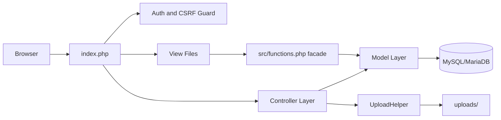
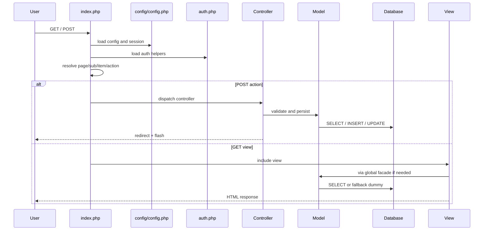
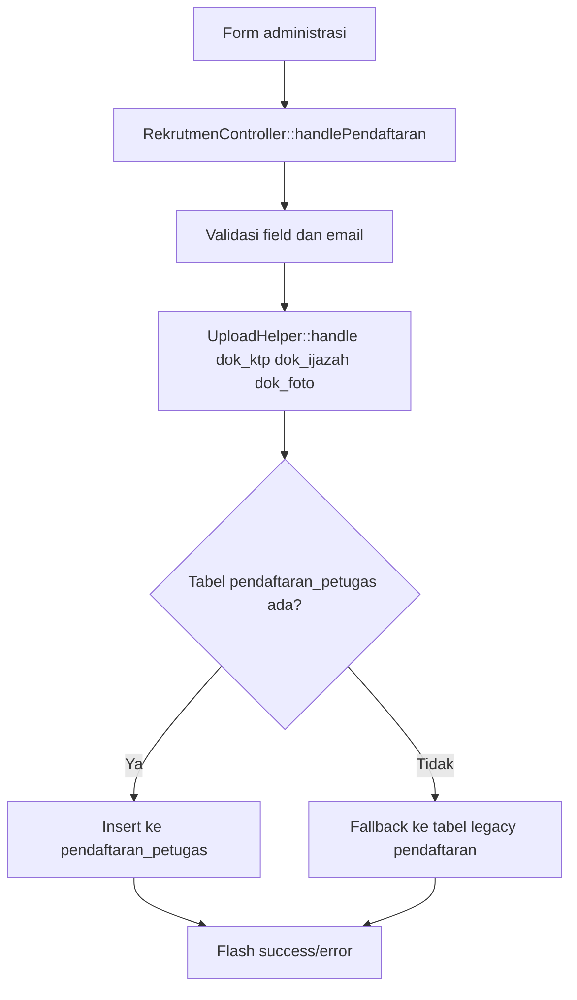
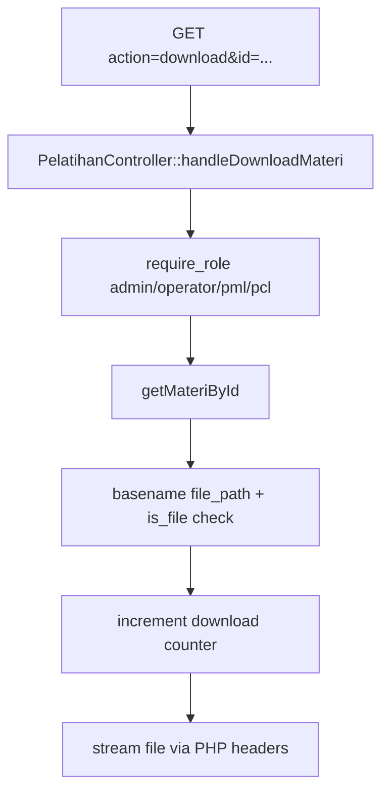

# SISE2026 Jember - Technical Documentation

> Snapshot implementasi per **19 Maret 2026** berdasarkan kode yang ada di workspace saat ini.

## Table of Contents

1. [Overview](#overview)
2. [Technology Stack](#technology-stack)
3. [Architecture](#architecture)
4. [Source Tree](#source-tree)
5. [Module Catalog](#module-catalog)
6. [Request and Data Flows](#request-and-data-flows)
7. [Routing and API Specification](#routing-and-api-specification)
8. [Dummy Data and Test Fixtures](#dummy-data-and-test-fixtures)
9. [Database Notes](#database-notes)
10. [Installation Guide](#installation-guide)
11. [Usage Examples](#usage-examples)
12. [Testing and Static Analysis](#testing-and-static-analysis)
13. [Security and Coding Conventions](#security-and-coding-conventions)
14. [Resolved Fixes in This Audit](#resolved-fixes-in-this-audit)
15. [Residual Limitations](#residual-limitations)

## Overview

SISE2026 Jember adalah aplikasi PHP native untuk mendukung operasi Sensus Ekonomi 2026 di Kabupaten Jember. Implementasi saat ini mencakup:

- autentikasi dan RBAC untuk `admin`, `operator`, `pml`, dan `pcl`
- rekrutmen petugas dan pengecekan status pendaftaran
- pelatihan online/offline, forum tanya jawab, dan distribusi materi
- pengelolaan surat keputusan, surat masuk, dan surat keluar
- pelaporan anomali pengolahan
- modul dokumentasi dan memorandum yang sudah CRUD penuh, plus laporan/notulen yang masih view-only

Aplikasi memakai pola ringan `front controller -> controller -> model -> view`, tanpa framework besar. Fallback demo disediakan di `App\Utils\DummyData` agar modul tetap bisa dirender saat tabel tertentu belum terisi.

## Technology Stack

| Layer | Implementasi |
|---|---|
| Backend | PHP native 7.4+/8.x |
| Routing | `index.php` |
| Autoload | Composer PSR-4 (`App\\ => src/`) |
| Database | MySQL / MariaDB via PDO |
| Frontend | Blade-less PHP views + Tailwind-style utility classes + vanilla JS |
| Upload validation | `finfo`, extension whitelist, `.htaccess` |
| Test style | Script PHP mandiri, tanpa PHPUnit |

## Architecture

### High-level diagram



### Core components

| Komponen | Tanggung jawab |
|---|---|
| `index.php` | Routing GET/POST, guard role global, dispatch controller, pilih view |
| `config/config.php` | Memuat `.env`, session hardening, konstanta global, koneksi PDO |
| `src/auth.php` | Login, logout, helper role, helper user, CSRF, activity log |
| `src/functions.php` | Facade global untuk view lama dan helper escaping `e()` |
| `src/Controllers/*` | Validasi request, flash message, redirect, proteksi role |
| `src/Models/*` | Query database dan fallback ke dummy/legacy schema |
| `src/Utils/UploadHelper.php` | Validasi ukuran, ekstensi, MIME, nama file aman |
| `src/Utils/DummyData.php` | Fixture dummy terpusat untuk demo dan fallback |
| `views/*` | Presentasi HTML |

## Source Tree

```text
se2026-jember/
|-- config/
|   `-- config.php
|-- src/
|   |-- Controllers/
|   |-- Models/
|   |-- Utils/
|   |-- auth.php
|   `-- functions.php
|-- views/
|   |-- partials/
|   |-- rekrutmen/
|   |-- pelatihan/
|   |-- teknis/
|   |-- pengolahan/
|   `-- dokumentasi/
|-- assets/
|   |-- css/
|   `-- js/
|-- sql/
|   |-- schema.sql
|   |-- seed_dummy_data.sql
|   `-- bps_jember_se2026.sql
|-- tests/
|   |-- SecurityFixesTest.php
|   |-- UtilFunctionsTest.php
|   |-- ModelCompatibilityTest.php
|   `-- ViewSmokeTest.php
|-- uploads/
|   `-- .htaccess
`-- index.php
```

## Module Catalog

| Modul | Halaman utama | Controller / Model | Sumber data | Status |
|---|---|---|---|---|
| Auth | `?page=login`, `?page=logout` | `AuthController`, `src/auth.php` | `users`, `activity_logs` | Aktif |
| Rekrutmen | `?page=rekrutmen-petugas&sub=administrasi` | `RekrutmenController`, `RekrutmenModel` | `pendaftaran_petugas` atau `pendaftaran`, `wilayah_kerja` | Aktif |
| Lowongan legacy | `?page=rekrutmen` | `RekrutmenModel` | `lowongan` | Aktif untuk landing lama |
| Pengumuman | `?page=rekrutmen-petugas&sub=pengumuman` | `RekrutmenModel` | `pengumuman` | Aktif |
| Pelatihan | `?page=pelatihan&sub=online|offline|materi` | `PelatihanController`, `PelatihanModel` | `pelatihan`, `qna_pelatihan`, `materi_pelatihan` atau `materi_bahan` | Aktif |
| Surat dan SK | `?page=teknis-dan-administrasi&sub=kelengkapan-administrasi&item=...` | `SuratController`, `SuratModel` | `surat_keputusan`, `surat_masuk`, `surat_keluar`, `memorandum`, `konfirmasi_kehadiran` | Aktif |
| Pengolahan | `?page=pengolahan&sub=anomaly|monitoring` | `PengolahanController`, `PengolahanModel` | `anomaly`, dummy sektor progress | Aktif sebagian |
| Dokumentasi | `?page=dokumentasi&sub=...` | `DokumentasiController`, `DokumentasiModel` | `dokumentasi` | Aktif |
| Memorandum | `?page=teknis-dan-administrasi&sub=kelengkapan-administrasi&item=memorandum` | `SuratController`, `SuratModel` | `memorandum`, `konfirmasi_kehadiran` | Aktif |
| Laporan / Notulen | `?page=teknis-dan-administrasi&sub=kelengkapan-administrasi&item=...` | View + `DummyData` | `DummyData` | View-only |

### Data source policy

- Modul yang benar-benar writeable memakai tabel database.
- Modul yang masih `view-only` memakai fixture dari `App\Utils\DummyData`.
- Beberapa model mendukung schema lama dan baru secara bersamaan.

## Request and Data Flows

### Bootstrap request



### Public recruitment submission flow



### Protected material download flow



## Routing and API Specification

Semua endpoint memakai query parameter pada `index.php`. Ini bukan REST API terpisah; spesifikasi di bawah menjelaskan kontrak request yang aktif.

### Public and shared endpoints

| Endpoint | Method | Handler / View | Access |
|---|---|---|---|
| `?page=beranda` | GET | `views/home.php` | Public |
| `?page=login` | GET | `views/login.php` | Public |
| `?page=login` | POST | `AuthController::handleLogin()` | Public |
| `?page=logout` | GET | `AuthController::handleLogout()` | Logged-in user |
| `?page=dashboard` | GET | `views/dashboard.php` | Logged-in user |

### Recruitment endpoints

| Endpoint | Method | Handler / View | Notes |
|---|---|---|---|
| `?page=rekrutmen` | GET | `views/rekrutmen.php` | Landing lowongan legacy |
| `?page=rekrutmen-petugas&sub=administrasi` | GET | `views/rekrutmen/administrasi.php` | Form publik + lookup status |
| `?page=rekrutmen-petugas&sub=administrasi&action=daftar` | POST | `RekrutmenController::handlePendaftaran()` | Upload KTP, ijazah, foto |
| `?page=rekrutmen-petugas&sub=pengumuman` | GET | `views/rekrutmen/pengumuman.php` | Menampilkan pengumuman published |
| `?page=rekrutmen-petugas&sub=alokasi-petugas-dan-wilayah` | GET | `views/rekrutmen/alokasi.php` | Ringkasan wilayah |

#### `handlePendaftaran` request fields

| Field | Tipe | Wajib | Keterangan |
|---|---|---|---|
| `nama_lengkap` | string | Ya | Nama pelamar |
| `nik` | string numeric | Ya | Dinormalisasi menjadi digit-only |
| `email` | email | Ya | Diverifikasi dengan `FILTER_VALIDATE_EMAIL` |
| `no_hp` | string | Ya | Nomor kontak |
| `alamat` | text | Ya | Alamat domisili |
| `posisi` | enum `PCL`/`PML` | Ya | Posisi yang dilamar |
| `wilayah` | string | Ya | Nama kecamatan |
| `dok_ktp` | file | Opsional | Dicek ukuran, ekstensi, MIME |
| `dok_ijazah` | file | Opsional | Dicek ukuran, ekstensi, MIME |
| `dok_foto` | file | Opsional | Dicek ukuran, ekstensi, MIME |

### Training endpoints

| Endpoint | Method | Handler / View | Access |
|---|---|---|---|
| `?page=pelatihan&sub=online` | GET | `views/pelatihan/online.php` | All logged-in roles |
| `?page=pelatihan&sub=offline` | GET | `views/pelatihan/offline.php` | All logged-in roles |
| `?page=pelatihan&sub=materi` | GET | `views/pelatihan/materi.php` | All logged-in roles |
| `?page=pelatihan&sub=online&action=ask` | POST | `PelatihanController::handleAsk()` | All logged-in roles |
| `?page=pelatihan&sub=materi&action=upload` | POST | `PelatihanController::handleUploadMateri()` | Admin, Operator |
| `?page=pelatihan&sub=materi&action=download&id={id}` | GET | `PelatihanController::handleDownloadMateri()` | Admin, Operator, PML, PCL |

#### `handleUploadMateri` request fields

| Field | Tipe | Wajib | Keterangan |
|---|---|---|---|
| `judul` | string | Ya | Judul materi |
| `kategori` | string | Ya | Kategori tampilan |
| `tipe` | enum `PDF/PPT/PPTX/XLS/XLSX/MP4` | Ya | Dinormalisasi ke uppercase |
| `file_materi` | file | Ya | Ekstensi harus cocok dengan `tipe` |

### Administration endpoints

| Endpoint | Method | Handler / View | Access |
|---|---|---|---|
| `?page=teknis-dan-administrasi&sub=kelengkapan-administrasi&item=sk` | GET | `views/teknis/sk.php` | Admin, Operator |
| `?page=teknis-dan-administrasi&sub=kelengkapan-administrasi&item=sk&action=tambah-sk` | POST | `SuratController::handleTambahSK()` | Admin, Operator |
| `?page=teknis-dan-administrasi&sub=kelengkapan-administrasi&item=surat-masuk&action=tambah-surat` | POST | `SuratController::handleTambahSuratMasuk()` | Admin, Operator |
| `?page=teknis-dan-administrasi&sub=kelengkapan-administrasi&item=surat-keluar&action=tambah-surat` | POST | `SuratController::handleTambahSuratKeluar()` | Admin, Operator |
| `?page=teknis-dan-administrasi&sub=kelengkapan-administrasi&item=memorandum` | GET | `views/teknis/memorandum.php` | Admin, Operator |
| `?page=teknis-dan-administrasi&sub=kelengkapan-administrasi&item=memorandum&action=tambah-memorandum` | POST | `SuratController::handleTambahMemorandum()` | Admin, Operator |
| `?page=teknis-dan-administrasi&sub=kelengkapan-administrasi&item=memorandum&action=update-memorandum&id={id}` | POST | `SuratController::handleUpdateMemorandum()` | Admin, Operator |
| `?page=teknis-dan-administrasi&sub=kelengkapan-administrasi&item=memorandum&action=hapus-memorandum&id={id}` | POST | `SuratController::handleHapusMemorandum()` | Admin, Operator |
| `?page=teknis-dan-administrasi&sub=kelengkapan-administrasi&item=laporan` | GET | `views/teknis/laporan_kegiatan.php` | All logged-in roles |
| `?page=teknis-dan-administrasi&sub=kelengkapan-administrasi&item=notulen` | GET | `views/teknis/notulen_rapat.php` | All logged-in roles |

### Processing and documentation endpoints

| Endpoint | Method | Handler / View | Access |
|---|---|---|---|
| `?page=pengolahan&sub=anomaly` | GET | `views/pengolahan/anomaly.php` | All logged-in roles |
| `?page=pengolahan&sub=anomaly&action=lapor` | POST | `PengolahanController::handleLaporAnomaly()` | All logged-in roles |
| `?page=pengolahan&sub=monitoring` | GET | `views/pengolahan/monitoring.php` | All logged-in roles |
| `?page=dokumentasi&sub=pelatihan-online` | GET | `views/dokumentasi/pelatihan_online.php` | All logged-in roles |
| `?page=dokumentasi&sub=pelatihan-offline` | GET | `views/dokumentasi/pelatihan_offline.php` | All logged-in roles |
| `?page=dokumentasi&sub=rapat` | GET | `views/dokumentasi/rapat.php` | All logged-in roles |
| `?page=dokumentasi&sub=foto` | GET | `views/dokumentasi/foto_kegiatan.php` | All logged-in roles |
| `?page=dokumentasi&sub={sub}&action=tambah` | POST | `DokumentasiController::handleTambah()` | Admin, Operator |
| `?page=dokumentasi&sub={sub}&action=update&id={id}` | POST | `DokumentasiController::handleUpdate()` | Admin, Operator |
| `?page=dokumentasi&sub={sub}&action=hapus&id={id}` | POST | `DokumentasiController::handleHapus()` | Admin, Operator |
| `?page=dokumentasi&sub={sub}&action=download&id={id}` | GET | `DokumentasiController::handleDownload()` | All logged-in roles |

## Dummy Data and Test Fixtures

### SQL seed

`sql/seed_dummy_data.sql` sekarang mengisi data realistis untuk modul yang bergantung pada database:

- akun demo yang sinkron dengan halaman login
- lowongan dan pendaftaran dengan seluruh status utama
- pengumuman published dan unpublished
- pelatihan online/offline beserta QnA
- materi pelatihan lintas tipe file
- anomaly dengan seluruh status workflow
- surat keputusan, surat masuk, surat keluar, dan memorandum
- dokumentasi lintas kategori: video, offline, rapat, dan foto kegiatan
- mirror ke tabel legacy `pendaftaran` untuk instalasi lama

### In-memory fixture

`src/Utils/DummyData.php` dipakai oleh modul yang belum memiliki CRUD aktif atau saat query runtime fallback:

- jadwal seleksi rekrutmen
- monitoring progres sektor
- laporan kegiatan dan notulen
- dokumentasi video, album, rapat, dan foto saat tabel `dokumentasi` kosong atau koneksi DB gagal

### Demo credentials

| Username | Password | Role |
|---|---|---|
| `admin` | `DemoSE2026!` | Admin |
| `operator.jember` | `DemoSE2026!` | Operator |
| `pml.kaliwates` | `DemoSE2026!` | PML |
| `pcl.sumbersari` | `DemoSE2026!` | PCL |

## Database Notes

### Primary schema files

| File | Peran |
|---|---|
| `sql/schema.sql` | Schema canonical untuk instalasi baru |
| `sql/seed_dummy_data.sql` | Seed idempotent untuk data demo dan regression fixture |
| `sql/bps_jember_se2026.sql` | Dump historis yang lebih besar, dipertahankan sebagai referensi legacy |

### Main tables used by runtime

| Area | Tabel |
|---|---|
| Auth | `users`, `activity_logs` |
| Rekrutmen | `lowongan`, `pendaftaran_petugas`, `pendaftaran`, `wilayah_kerja`, `pengumuman` |
| Pelatihan | `pelatihan`, `qna_pelatihan`, `materi_pelatihan`, `materi_bahan` |
| Teknis | `surat_keputusan`, `surat_masuk`, `surat_keluar`, `memorandum`, `konfirmasi_kehadiran` |
| Dokumentasi | `dokumentasi` |
| Pengolahan | `anomaly` |

### Compatibility strategy

- `RekrutmenModel` fallback ke tabel `pendaftaran` bila `pendaftaran_petugas` belum ada.
- `PelatihanModel` fallback ke `materi_bahan` bila `materi_pelatihan` belum ada.
- `DummyData` dipakai jika koneksi gagal atau tabel kosong.

## Installation Guide

### Requirements

- PHP 7.4+ atau PHP 8.x
- MySQL / MariaDB
- ekstensi `pdo_mysql`
- ekstensi `fileinfo`
- Composer
- web server lokal seperti Apache/Laragon atau built-in server PHP

### Setup steps

1. Tempatkan project pada webroot, misalnya `C:\laragon\www\se2026-jember`.
2. Salin `.env.example` menjadi `.env`.
3. Isi minimal variabel berikut:
   - `DB_HOST`
   - `DB_PORT`
   - `DB_NAME`
   - `DB_USER`
   - `DB_PASS`
4. Jalankan autoload Composer:

```bash
composer dump-autoload
```

5. Import schema utama:

```bash
mysql -u root -p bps_jember_se2026 < sql/schema.sql
```

6. Import seed demo:

```bash
mysql -u root -p bps_jember_se2026 < sql/seed_dummy_data.sql
```

7. Pastikan folder `uploads/` writable.
8. Jalankan server:

```bash
php -S localhost:8000
```

9. Buka aplikasi:

```text
http://localhost:8000/?page=beranda
```

### Important configuration

| Konstanta | Lokasi | Fungsi |
|---|---|---|
| `UPLOAD_DIR` | `config/config.php` | Path upload |
| `MAX_FILE_SIZE` | `config/config.php` | Batas upload default 5 MB |
| `ALLOWED_EXTENSIONS` | `config/config.php` | Whitelist ekstensi |
| `ALLOWED_MIME_TYPES` | `config/config.php` | Whitelist MIME |
| `START_DATE`, `END_DATE` | `config/config.php` | Rentang waktu sensus |

### Notes

- Loader `.env` membersihkan kutip di value agar format `.env` lebih toleran.
- `base_url` sekarang dihitung dinamis dari path aplikasi, tidak lagi hardcoded.
- Instalasi lama yang belum memiliki `lowongan`, `pendaftaran_petugas`, atau `materi_pelatihan` tetap bisa diisi oleh seed kompatibilitas.

## Usage Examples

### Login

```http
POST /?page=login
Content-Type: application/x-www-form-urlencoded

username=admin&password=DemoSE2026!
```

### Public recruitment submission

```http
POST /?page=rekrutmen-petugas&sub=administrasi&action=daftar
Content-Type: multipart/form-data

nama_lengkap=Ayu Nabila Putri
nik=3509305501010001
email=ayu.nabila@example.id
no_hp=081233445566
alamat=Jl. Mastrip No. 14, Sumbersari, Jember
posisi=PCL
wilayah=Sumbersari
dok_ktp=@ayu_ktp.pdf
dok_ijazah=@ayu_ijazah.pdf
dok_foto=@ayu_foto.jpg
```

### Ask a question in training forum

```http
POST /?page=pelatihan&sub=online&action=ask
Content-Type: application/x-www-form-urlencoded

pelatihan_id=1&pertanyaan=Apakah sinkronisasi bisa dilakukan saat koneksi putus-putus?
```

### Upload training material

```http
POST /?page=pelatihan&sub=materi&action=upload
Content-Type: multipart/form-data

judul=Pedoman Pencacahan SE2026
kategori=Pedoman
tipe=PDF
file_materi=@pedoman_pencacahan_se2026.pdf
```

### Download training material

```http
GET /?page=pelatihan&sub=materi&action=download&id=1
```

### Report anomaly

```http
POST /?page=pengolahan&sub=anomaly&action=lapor
Content-Type: application/x-www-form-urlencoded

judul=Duplikasi usaha kuliner pada dua blok sensus
wilayah=Kec. Kaliwates
deskripsi=Usaha tercatat dua kali pada blok bertetangga.
status=reported
```

### Create memorandum

```http
POST /?page=teknis-dan-administrasi&sub=kelengkapan-administrasi&item=memorandum&action=tambah-memorandum
Content-Type: application/x-www-form-urlencoded

nomor=MEMO/005/2026
tipe=undangan
judul=Undangan Evaluasi Lapangan Mingguan
tanggal=2026-03-29
waktu=09:00
tempat=Aula BPS Jember
konten=Evaluasi mingguan progres lapangan dan tindak lanjut wilayah kritis.
distribusi_email=1
distribusi_sms=1
```

### Upload dokumentasi rapat

```http
POST /?page=dokumentasi&sub=rapat&action=tambah
Content-Type: multipart/form-data

judul=Notulen Rakor Persiapan Lapangan
tanggal=2026-03-10
tags=rapat,notulen,persiapan
deskripsi=Notulen rapat koordinasi lintas tim menjelang distribusi wilayah kerja.
watermark=1
file_dokumentasi=@dokumentasi_rapat_rakor_se2026.pdf
```

## Testing and Static Analysis

### Commands used in this audit

```bash
Get-ChildItem -Recurse -Filter *.php | Where-Object { $_.FullName -notmatch '\\vendor\\' } | ForEach-Object { php -l $_.FullName }
php tests/SecurityFixesTest.php
php tests/UtilFunctionsTest.php
php tests/ModelCompatibilityTest.php
php tests/ViewSmokeTest.php
```

### Test coverage summary

| Script | Fokus |
|---|---|
| `tests/SecurityFixesTest.php` | `.env`, session, CSRF, MIME validation, HTTPS/base URL, session cookie |
| `tests/UtilFunctionsTest.php` | helper facade, badge helper, data retrieval dasar |
| `tests/ModelCompatibilityTest.php` | schema drift, alias auth, write path kompatibilitas, dummy material, upload guard |
| `tests/ViewSmokeTest.php` | render representative views dengan notice/warning dipromosikan ke exception |

### Current result

- Lint PHP: bersih
- Security tests: lulus
- Utility tests: lulus
- Compatibility tests: lulus
- View smoke tests: lulus

## Security and Coding Conventions

### Security controls

- session cookie `httponly` dan `samesite=Strict`
- `secure` cookie aktif otomatis saat HTTPS
- CSRF token berbasis `random_bytes` dan `hash_equals`
- upload divalidasi dengan ukuran, ekstensi, dan MIME aktual
- nama file upload disanitasi dan diberi suffix acak
- download materi dilindungi `require_role()` dan file dikirim lewat PHP stream
- folder `uploads/` dibatasi oleh `.htaccess`

### Coding conventions used

- helper `e()` dipakai untuk escaping output dinamis
- controller menangani request/redirect, model menangani query
- facade global dipertahankan untuk kompatibilitas view lama
- komentar perbaikan ditambahkan langsung di titik perubahan penting

## Resolved Fixes in This Audit

Perbaikan yang sudah diterapkan di kode dan schema:

- alias `auth_get_user_id()` ditambahkan agar kode lama tidak fatal
- insert anomaly tidak lagi mengasumsikan kolom `created_by` yang tidak ada
- `UploadHelper::handle()` aman menerima payload file kosong
- nama file upload diberi suffix acak untuk mengurangi collision
- validasi upload materi kini mengecek kecocokan `tipe` terhadap ekstensi file
- download materi kini terlindungi role check dan memakai `basename()` untuk mencegah traversal
- route guard `teknis-dan-administrasi` diselaraskan dengan submenu yang memang diizinkan
- memorandum sudah dipromosikan dari `view-only` menjadi CRUD penuh dengan controller, model, seed, dan smoke test edit mode
- dokumentasi sudah dipromosikan menjadi CRUD penuh dengan upload, download terproteksi, seed lintas kategori, dan smoke test edit mode
- data dummy dipusatkan ke `DummyData` untuk lowongan, surat, monitoring, memorandum, notulen, laporan, dan dokumentasi
- `views/pengolahan/monitoring.php` dirapikan agar output sektor memakai escaping
- `sql/schema.sql` dibersihkan dari definisi tabel `lowongan` yang ganda
- `sql/seed_dummy_data.sql` diperbarui menjadi idempotent dan sinkron dengan kredensial demo aktual
- `TECHNICAL_DOCUMENTATION.md` diperbarui berdasarkan implementasi tervalidasi, bukan gap lama

## Residual Limitations

- laporan kegiatan dan notulen masih `view-only`; belum ada controller CRUD aktif
- fallback dummy data berguna untuk demo, tetapi bisa menutupi masalah database jika dipakai tanpa monitoring
- belum ada integration test HTTP end-to-end
- `sql/bps_jember_se2026.sql` adalah dump legacy; untuk instalasi baru sebaiknya gunakan `schema.sql` + `seed_dummy_data.sql`

Dokumen ini harus diperbarui bersamaan dengan perubahan routing, query runtime, atau struktur tabel agar tidak kembali tertinggal dari implementasi.
